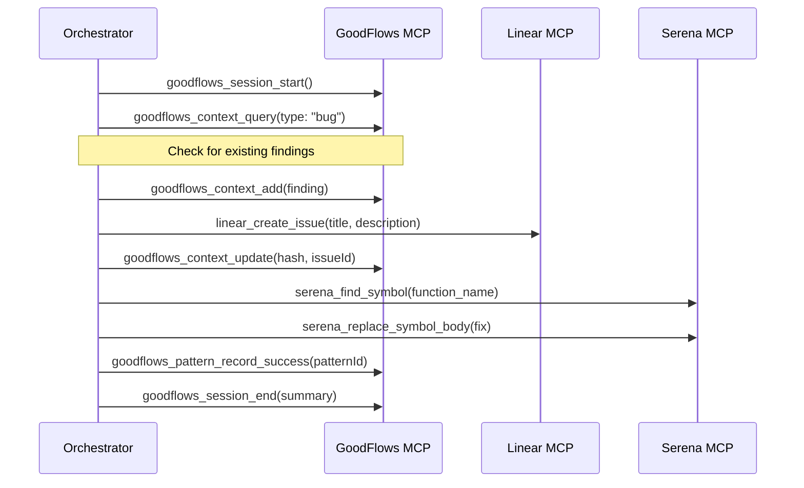

# GoodFlows MCP Server Setup Guide

Complete guide for installing and configuring the GoodFlows MCP (Model Context Protocol) Server with Claude Code.

## Table of Contents

- [Overview](#overview)
- [Prerequisites](#prerequisites)
- [Installation Methods](#installation-methods)
  - [Method 1: NPM Global Install](#method-1-npm-global-install-recommended)
  - [Method 2: NPM Link (Development)](#method-2-npm-link-development)
  - [Method 3: Direct Path](#method-3-direct-path)
- [Claude Code Configuration](#claude-code-configuration)
  - [Global Settings](#global-settings)
  - [Project-Specific Settings](#project-specific-settings)
- [Verification](#verification)
- [Available Tools](#available-tools)
- [Troubleshooting](#troubleshooting)
- [Integration with Other MCP Servers](#integration-with-other-mcp-servers)

---

## Overview

The GoodFlows MCP Server exposes GoodFlows functionality to Claude Code agents through the Model Context Protocol. This enables agents to:

- **Query and deduplicate findings** before creating issues
- **Share context between agents** via sessions
- **Get fix pattern recommendations** based on historical success
- **Process findings by priority** (critical security first)

```
┌─────────────────────────────────────────────────────────────┐
│                     Claude Code                              │
│  ┌─────────────────────────────────────────────────────────┐│
│  │  Agents: review-orchestrator, issue-creator, auto-fixer ││
│  └─────────────────────────────────────────────────────────┘│
│                            │                                 │
│                            ▼                                 │
│  ┌─────────────────────────────────────────────────────────┐│
│  │              MCP Server Layer                           ││
│  │  ┌─────────────┐ ┌─────────────┐ ┌─────────────┐       ││
│  │  │  goodflows  │ │   linear    │ │   serena    │       ││
│  │  │  (context,  │ │  (issues)   │ │   (code)    │       ││
│  │  │  sessions)  │ │             │ │             │       ││
│  │  └─────────────┘ └─────────────┘ └─────────────┘       ││
│  └─────────────────────────────────────────────────────────┘│
│                            │                                 │
│                            ▼                                 │
│  ┌─────────────────────────────────────────────────────────┐│
│  │  Storage: .goodflows/context/, .serena/memories/        ││
│  └─────────────────────────────────────────────────────────┘│
└─────────────────────────────────────────────────────────────┘
```

---

## Prerequisites

### Required

| Requirement | Version | Check Command |
|-------------|---------|---------------|
| Node.js | >= 18.0.0 | `node --version` |
| npm | >= 8.0.0 | `npm --version` |
| Claude Code | >= 2.0.0 | `claude --version` |

### Optional (for full workflow)

| Requirement | Purpose | Install |
|-------------|---------|---------|
| Linear API Key | Issue management | [linear.app/settings/api](https://linear.app/settings/api) |
| CodeRabbit CLI | Code review | `npm install -g @coderabbit/cli` |

---

## Installation Methods

### Method 1: NPM Global Install (Recommended)

For production use, install from npm:

```bash
# Install globally
npm install -g goodflows

# Verify installation
which goodflows-mcp-server
# Should output: /usr/local/bin/goodflows-mcp-server (or similar)

# Test the server starts
goodflows-mcp-server --help
```

### Method 2: NPM Link (Development)

For local development or testing unreleased versions:

```bash
# Clone or navigate to the GoodFlows repository
cd /path/to/goodflows

# Install dependencies
npm install

# Link globally
npm link

# Verify link
which goodflows-mcp-server
# Should output: ~/.npm-global/bin/goodflows-mcp-server (or similar)
```

**To unlink later:**
```bash
cd /path/to/goodflows
npm unlink -g goodflows
```

### Method 3: Direct Path

For testing or when global install isn't possible:

```bash
# Run directly with node
node /path/to/goodflows/bin/mcp-server.js
```

In Claude settings, use the full path:
```json
{
  "mcpServers": {
    "goodflows": {
      "command": "node",
      "args": ["/absolute/path/to/goodflows/bin/mcp-server.js"]
    }
  }
}
```

---

## Claude Code Configuration

### Global Settings

Apply to all projects. Edit `~/.claude/settings.json`:

```json
{
  "mcpServers": {
    "goodflows": {
      "command": "npx",
      "args": ["goodflows-mcp-server"]
    }
  }
}
```

### Project-Specific Settings

Apply only to a specific project. Create `.claude/settings.local.json` in your project root:

```json
{
  "mcpServers": {
    "goodflows": {
      "command": "npx",
      "args": ["goodflows-mcp-server"]
    },
    "linear": {
      "command": "npx",
      "args": ["@anthropic-ai/linear-mcp-server"],
      "env": {
        "LINEAR_API_KEY": "lin_api_xxxxxxxxxxxx"
      }
    }
  }
}
```

### Full Configuration (All MCP Servers)

Complete setup with GoodFlows, Linear, and Serena:

```json
{
  "mcpServers": {
    "goodflows": {
      "command": "npx",
      "args": ["goodflows-mcp-server"],
      "env": {}
    },
    "linear": {
      "command": "npx",
      "args": ["@anthropic-ai/linear-mcp-server"],
      "env": {
        "LINEAR_API_KEY": "lin_api_xxxxxxxxxxxx"
      }
    },
    "serena": {
      "command": "npx",
      "args": ["serena-mcp-server"],
      "env": {}
    }
  }
}
```

### Environment Variables

You can also use environment variable references:

```json
{
  "mcpServers": {
    "linear": {
      "command": "npx",
      "args": ["@anthropic-ai/linear-mcp-server"],
      "env": {
        "LINEAR_API_KEY": "${LINEAR_API_KEY}"
      }
    }
  }
}
```

Then set in your shell:
```bash
export LINEAR_API_KEY="lin_api_xxxxxxxxxxxx"
```

---

## Verification

### Step 1: Restart Claude Code

After changing settings, restart Claude Code to load the new MCP servers:

```bash
# Exit Claude Code (Ctrl+C or /exit)
# Then restart
claude
```

### Step 2: Check MCP Server Status

In Claude Code, the MCP servers should connect automatically. You can verify by running:

```
/mcp
```

Or by attempting to use a tool:
```
Use the goodflows_stats tool to check the context store
```

### Step 3: Verify Tools Available

Run `/agents` in Claude Code - the agents should show tools without "Unrecognized" warnings:

```
╭─────────────────────────────────────────────────────╮
│ review-orchestrator                                 │
│ Tools: Bash, Read, Grep, Glob,                     │
│        goodflows_context_query,                    │  ← Should be recognized
│        goodflows_session_start,                    │
│        linear_list_teams, ...                      │
╰─────────────────────────────────────────────────────╯
```

### Step 4: Test Tool Execution

Ask Claude to use a GoodFlows tool:

```
Query the goodflows context store for any existing findings
```

Expected response:
```json
{
  "count": 0,
  "findings": []
}
```

---

## Available Tools

### Context Store Tools

| Tool | Description | Example Use |
|------|-------------|-------------|
| `goodflows_context_query` | Query findings by type, file, status | Check for duplicates before creating issues |
| `goodflows_context_add` | Add a finding with automatic deduplication | Store CodeRabbit findings |
| `goodflows_context_update` | Update finding status, link to issue | Mark as fixed, add issue ID |
| `goodflows_context_check_duplicate` | Check if similar finding exists | Avoid duplicate issues |
| `goodflows_context_export` | Export findings to markdown | Generate reports |

### Session Tools

| Tool | Description | Example Use |
|------|-------------|-------------|
| `goodflows_session_start` | Start a new workflow session | Begin review workflow |
| `goodflows_session_resume` | Resume existing session | Continue in another agent |
| `goodflows_session_get_context` | Read from shared context | Get findings from orchestrator |
| `goodflows_session_set_context` | Write to shared context | Store created issues |
| `goodflows_session_checkpoint` | Create rollback point | Before risky operations |
| `goodflows_session_rollback` | Rollback to checkpoint | On failure |
| `goodflows_session_end` | End and persist session | Workflow complete |

### Pattern Tracker Tools

| Tool | Description | Example Use |
|------|-------------|-------------|
| `goodflows_pattern_recommend` | Get fix recommendations by type | Find patterns for security fixes |
| `goodflows_pattern_record_success` | Record successful fix | Improve confidence score |
| `goodflows_pattern_record_failure` | Record failed fix | Decrease confidence |
| `goodflows_pattern_add` | Add new fix pattern | Create reusable templates |

### Priority Queue Tools

| Tool | Description | Example Use |
|------|-------------|-------------|
| `goodflows_queue_create` | Create priority-sorted queue | Process critical issues first |
| `goodflows_queue_next` | Get next highest priority item | Sequential processing |
| `goodflows_queue_complete` | Mark item complete | After successful fix |
| `goodflows_queue_fail` | Mark item failed (auto-retry) | On error |
| `goodflows_queue_stats` | Get queue statistics | Monitor progress |

### Statistics

| Tool | Description |
|------|-------------|
| `goodflows_stats` | Get overall statistics (context, patterns, sessions) |

---

## Troubleshooting

### Error: Cannot find package '@modelcontextprotocol/sdk'

**Cause:** Dependencies not installed.

**Solution:**
```bash
cd /path/to/goodflows
npm install
```

### Error: command not found: goodflows-mcp-server

**Cause:** Package not linked or installed globally.

**Solution:**
```bash
# Option 1: Install globally
npm install -g goodflows

# Option 2: Link from source
cd /path/to/goodflows
npm link
```

### MCP Server Not Recognized in Claude Code

**Cause:** Settings not reloaded or incorrect path.

**Solutions:**

1. **Restart Claude Code** completely (exit and reopen)

2. **Check settings file location:**
   - Global: `~/.claude/settings.json`
   - Project: `.claude/settings.local.json`

3. **Validate JSON syntax:**
   ```bash
   cat ~/.claude/settings.json | python -m json.tool
   ```

4. **Check for typos** in server name (must be exactly `goodflows`)

### Tools Show as "Unrecognized" in /agents

**Cause:** MCP server not connected or wrong tool names in agent files.

**Solution:**
1. Verify MCP server is running (check Step 2 in Verification)
2. Ensure agent files use correct tool names:
   - ✅ `goodflows_context_query`
   - ❌ `mcp__plugin_goodflows__context_query`

### Session/Context Data Not Persisting

**Cause:** Missing `.goodflows/context/` directory.

**Solution:**
```bash
# Initialize GoodFlows in your project
cd /your/project
goodflows init
```

### Linear Tools Not Working

**Cause:** Missing or invalid API key.

**Solution:**
1. Get API key from [linear.app/settings/api](https://linear.app/settings/api)
2. Add to settings:
   ```json
   "env": {
     "LINEAR_API_KEY": "lin_api_xxxxxxxxxxxx"
   }
   ```
3. Or set environment variable:
   ```bash
   export LINEAR_API_KEY="lin_api_xxxxxxxxxxxx"
   ```

---

## Integration with Other MCP Servers

### Recommended Stack

| MCP Server | Purpose | Required |
|------------|---------|----------|
| **goodflows** | Context, sessions, patterns, queues | Yes |
| **linear** | Issue creation and management | Yes (for issue tracking) |
| **serena** | Code analysis and semantic editing | Optional (enhances auto-fixer) |

### Tool Naming Convention

MCP tools follow the pattern `{server}_{toolname}`:

| Server | Tool Example |
|--------|--------------|
| goodflows | `goodflows_context_query` |
| linear | `linear_create_issue` |
| serena | `serena_find_symbol` |

### Workflow Integration



---

## Quick Reference

### Minimum Setup (Copy & Paste)

```json
{
  "mcpServers": {
    "goodflows": {
      "command": "npx",
      "args": ["goodflows-mcp-server"]
    }
  }
}
```

### Full Setup (Copy & Paste)

```json
{
  "mcpServers": {
    "goodflows": {
      "command": "npx",
      "args": ["goodflows-mcp-server"]
    },
    "linear": {
      "command": "npx",
      "args": ["@anthropic-ai/linear-mcp-server"],
      "env": {
        "LINEAR_API_KEY": "YOUR_LINEAR_API_KEY_HERE"
      }
    }
  }
}
```

### Install Commands

```bash
# From npm (when published)
npm install -g goodflows

# From source
git clone https://github.com/goodwiins/goodflows.git
cd goodflows
npm install
npm link
```

---

## Support

- **Issues:** [github.com/goodwiins/goodflows/issues](https://github.com/goodwiins/goodflows/issues)
- **Documentation:** [CLAUDE.md](../CLAUDE.md)
- **Examples:** [templates/mcp-config.json](../templates/mcp-config.json)
